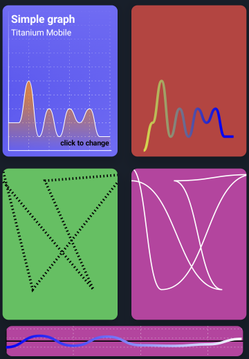

# ti.lines - Draw simple lines and graphs in Titanium Mobile



`ti.lines` allows you to draw simple line graphics or graphs in a views.

## Installation

* download the module from [Releases](./releases)
* put the ZIP into you project root
* add `<module>ti.lines</module>` to your tiapp.xml `<modules>` section.

## Example
```js
const lines = require('ti.lines');

const lineView = lines.createLine({
	width: 180,
	height: 230,
	lineWidth: 4,
	lineColor: "#fff",
	xAxis: true,
	yAxis: true,
	maxValue: 10,
	yLines: 1,
	xLines: 2,
	values: [2, 2, 5, 1, 3, 1, 3, 2, 3, 1, 1],
	startAt: lines.START_BOTTOM,
	fillSpace: true
});
```

Alloy:
```xml
<Line module="ti.lines" lineColor="#7541fd" fillSpace="true" fillColorTop="rgba(45,25,99,0.5)" fillColorBottom="rgba(0,0,0,0)"/>
```

Full example is available <a href="./example/app.js"/>here</a>.


## Methods

* clear() - clears the view
* redraw() - redraws the line after you change properties

## Properties

|Property|Type|Description|
|---|---|---|
| values | Array/Object | Can be a simple array `[2, 2, 5...]` to draw a graph or `[{x: 0, y: 0}, { x: 50, y: 200},...]` to draw lines |
| lineColor | Color | Color of the line |
| lineColorFrom | Color | Line color gradient - start color  |
| lineColorTo | Color | Line color gradient - end color |
| lineWidth | int | Width of the line |
| axisWidth | int | Width of the x/y axis |
| axisColor | Color | Color of the x/y axis |
| startAt | int | START_CENTER or START_BOTTOM. Will set the 0 point in the y-axis center or bottom |
| maxValue | int | Sets a custom max value for the y-axis and remaps your input values. Otherwise the view height will be the maxValue |
| xAxis | boolean | Show the x-axis |
| yAxis |boolean | Show the y-axis |
| yLines | int | Draws dotted y-axis lines. This value will be the steps (e.g. 1 will draw every x value, 2 will draw every 2nd value,...) |
| xLines | int | Draws dotted x-axis lines. This value will be the steps (e.g. 1 will draw every y value, 2 will draw every 2nd value,...)|
| lineType | int | TYPE_CURVED or TYPE_STRAIGHT. Will either draw a normal line or a bezier curve |
| strokeType | int | STROKE_NORMAL or STROKE_NORMAL. Different stroke style |
| fillSpace | boolean | Will fill the area below the curve (experimental) |
| fillColorTop | Color | Color at the top |
| fillColorBottom | Color | Color at the bottom |
| padding | int/array | Either one int value for all sides or 4 values: [top, right, bottom, left] as an array |

If you change properties after the view is visible you will need to call `redraw()` to see the changes.

## Constants

* **TYPE_CURVED**: bezier line
* **TYPE_STRAIGHT**: normal line
* **START_CENTER**: start in the center
* **START_BOTTOM**: start at the bottom
* **STROKE_NORMAL**: normal line
* **STROKE_DASHED**: dashed line

## iOS version

The iOS version is currently very limited and can only draw straight lines and you can use: `maxValue`, `values`, `lineColor`, `lineWidth`.

## License

MIT

## Author

* Android: Michael Gangolf
